# Arquitectura de KitchenFlow

Este documento explica cómo está armado **KitchenFlow** hoy: qué bibliotecas usa, cómo se divide el código, cómo viaja la información entre frontend, backend y MongoDB, y qué scripts existen para operar el proyecto.

La idea es que sirva como documento de **onboarding**. Si alguien entra al repo sin contexto, aquí debería poder entender:

- qué corre en cada capa,
- dónde vive cada responsabilidad,
- cómo se conectan los módulos,
- y por dónde seguir si necesita extender el sistema.

---

## 1. Visión general

KitchenFlow es una aplicación para operación de cafetería/panadería con estos módulos principales:

- **Autenticación y roles**
- **Abastecimiento / inventario de insumos**
- **Recetas y costeo**
- **Producción**
- **Ventas**
- **Dashboard**
- **Gestión de usuarios**

El flujo principal del negocio es:

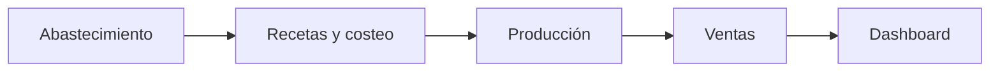

En términos prácticos:

1. se compran insumos,
2. se recalcula su costo promedio,
3. las recetas usan esos costos,
4. producción consume insumos y genera stock terminado,
5. ventas descuentan stock terminado,
6. dashboard consolida lo ocurrido.

---

## 2. Stack tecnológico

## Frontend

- **Angular 21**
- **TypeScript**
- **Angular Router**
- **Angular Forms**
- **Signals / computed / inject**
- **openapi-fetch** para consumir la API con tipos
- **@ng-icons/core** y **@ng-icons/lucide**
- **class-variance-authority** y **clsx** para variantes de UI

## Backend

- **Node.js**
- **Express**
- **Mongoose**
- **MongoDB**
- **JWT propio** firmado con `crypto`
- **hash de contraseñas con `crypto.scrypt`**

## Tooling

- **OpenAPI** como contrato de API
- **openapi-typescript** para generar tipos del frontend
- **ESLint**
- **Prettier**
- **Docker / Docker Compose**
- **Playwright** usado para automatizaciones puntuales y capturas

---

## 3. Estructura del repositorio

```text
/
├── frontend/                 # Angular app
├── backend/                  # Express + Mongoose API
├── scripts/                  # scripts compartidos del monorepo
├── report/                   # propuesta e informe de implementación
├── docker-compose.yml
├── eslint.config.mjs
├── prettier.config.mjs
└── package.json              # workspaces y scripts globales
```

## Frontend

```text
frontend/src/app
├── api/                      # cliente OpenAPI + tipos generados
├── components/               # componentes por dominio
├── guards/                   # protección de rutas
├── interfaces/               # tipos de dominio frontend
├── pages/                    # pantallas lazy-loaded
├── services/                 # servicios por módulo
└── shared/                   # UI base, pipes, catálogos, utilidades
```

## Backend

```text
backend/src
├── config/                   # server + database
├── controllers/              # lógica HTTP por módulo
├── docs/                     # OpenAPI document
├── helpers/                  # JWT, password hashing, helpers varios
├── middlewares/              # auth y autorización por rol
├── models/                   # schemas Mongoose
├── routes/                   # rutas Express
└── startup/                  # bootstrap inicial (usuarios demo)
```

---

## 4. Arquitectura por capas

La app está organizada como una arquitectura de dos capas principales:

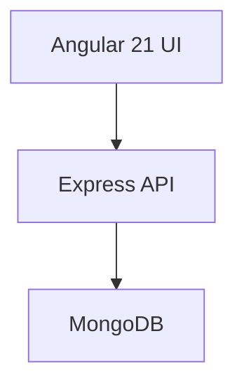

Pero internamente hay más piezas:

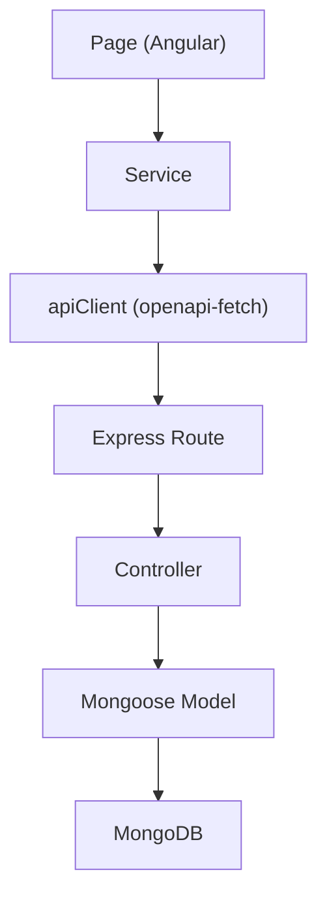

## Responsabilidad de cada parte

### Pages

Las `pages/` son pantallas completas: orquestan estado de la vista y usan servicios.

Ejemplos:

- `dashboard-page`
- `abastecimiento-page`
- `recetas-page`
- `produccion-page`
- `ventas-page`
- `usuarios-page`
- `login-page`

### Services

Los `services/` encapsulan consumo de API y estado reactivo del frontend.

Ejemplos:

- `auth.service.ts`
- `supply-service.ts`
- `recipes.service.ts`
- `production.service.ts`
- `sales.service.ts`
- `dashboard.service.ts`
- `users.service.ts`

### API client

`frontend/src/app/api/client.ts` construye el cliente de API tipado.

Responsabilidades:

- decidir `baseUrl`,
- adjuntar el `Bearer token`,
- exponer un cliente tipado con `openapi-fetch`.

### Controllers

Los controladores del backend contienen la lógica HTTP y de negocio.

Ejemplos:

- `auth.controller.js`
- `ingredients.controller.js`
- `purchase-records.controller.js`
- `recipes.controller.js`
- `production-batches.controller.js`
- `sales.controller.js`
- `analytics.controller.js`
- `users.controller.js`

### Models

Los models Mongoose son la fuente de verdad estructural de la base.

Colecciones principales:

- `User`
- `Ingredient`
- `PurchaseRecord`
- `Recipe`
- `ProductionBatch`
- `Sale`

---

## 5. Rutas frontend

Las rutas viven en `frontend/src/app/app.routes.ts`.

Se cargan con `loadComponent`, así que las pantallas principales son **lazy-loaded**.

Rutas actuales:

- `/login`
- `/dashboard`
- `/usuarios`
- `/abastecimiento`
- `/recetas`
- `/produccion`
- `/ventas`

Protección por rol:

- `ADMIN`
  - dashboard
  - usuarios
  - abastecimiento
  - recetas
  - producción
  - ventas
- `KITCHEN`
  - recetas
  - producción
- `FLOOR`
  - ventas

El guard principal está en:

- `frontend/src/app/guards/auth.guard.ts`

Y la sesión vive en:

- `frontend/src/app/services/auth.service.ts`

---

## 6. API backend

El servidor registra rutas bajo dos prefijos:

- `/api`
- `/awe/api`

Eso permite servirlo tanto en entorno local como detrás de despliegues donde el frontend vive bajo `/awe`.

### Rutas principales

- `POST /api/auth/login`
- `GET /api/auth/me`

- `GET /api/users`
- `POST /api/users`
- `PUT /api/users/:id`
- `POST /api/users/:id/reset-password`

- `GET /api/ingredients`
- `POST /api/ingredients`
- `PUT /api/ingredients/:id`
- `DELETE /api/ingredients/:id`

- `GET /api/purchase-records`
- `POST /api/purchase-records`

- `GET /api/recipes`
- `POST /api/recipes`
- `PUT /api/recipes/:id`
- `DELETE /api/recipes/:id`

- `GET /api/production-batches`
- `POST /api/production-batches`
- `POST /api/production-batches/:id/start`
- `POST /api/production-batches/:id/complete`
- `POST /api/production-batches/:id/cancel`

- `GET /api/sales`
- `POST /api/sales`

- `GET /api/analytics/dashboard`

- `GET /api/openapi.json`
- `GET /api/docs`

---

## 7. Modelo de datos

## `User`

Representa cuentas operativas del sistema.

Campos clave:

- `name`
- `email`
- `passwordHash`
- `role` (`ADMIN`, `KITCHEN`, `FLOOR`)
- `active`

## `Ingredient`

Representa insumos.

Campos clave:

- `name`
- `unit`
- `currentStock`
- `reservedStock`
- `averageCost`
- `minimumStock`
- `active`

`reservedStock` es importante para producción: permite apartar insumos antes de consumirlos realmente.

## `PurchaseRecord`

Representa entradas de abastecimiento.

Campos clave:

- `provider`
- `invoiceDate`
- `ingredient`
- `quantityReceived`
- `totalPrice`
- `unitPrice`
- `previousStock`
- `previousAverageCost`
- `newStock`
- `newAverageCost`

Sirve tanto como historial como evidencia del cálculo de WAC.

## `Recipe`

Representa un producto vendible y su receta.

Campos clave:

- `name`
- `category`
- `salePrice`
- `yieldText`
- `ingredients[]`
- `currentStock`
- `totalCost`
- `margin`
- `status`
- `active`

Aquí `currentStock` es el stock terminado disponible para ventas.

## `ProductionBatch`

Representa órdenes de producción.

Campos clave:

- `recipe`
- `status`
- `plannedQuantity`
- `actualQuantity`
- `plannedIngredients[]`
- `actualIngredients[]`
- `plannedTotalCost`
- `actualTotalCost`
- `wasteSummary`
- `startedAt`
- `completedAt`
- `cancelledAt`
- `durationMinutes`

Estados:

- `PENDING`
- `IN_PROGRESS`
- `COMPLETED`
- `CANCELLED`

## `Sale`

Representa tickets de venta.

Campos clave:

- `soldAt`
- `items[]`
- `totalItems`
- `totalRevenue`
- `totalCost`
- `totalMargin`
- `notes`

Cada línea del ticket guarda snapshot de:

- producto,
- cantidad,
- precio unitario,
- costo unitario,
- stock antes,
- stock después.

---

## 8. Flujo de datos por módulo

## 8.1 Autenticación

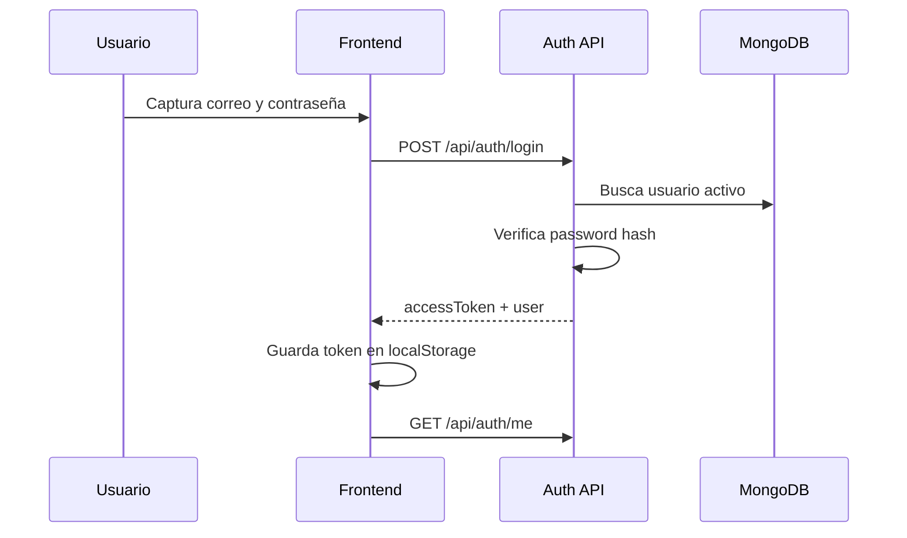

### Puntos clave

- El token se guarda en `localStorage`.
- `apiClient` lo adjunta como `Authorization: Bearer ...`.
- La sesión se restaura al arrancar la app.

---

## 8.2 Abastecimiento

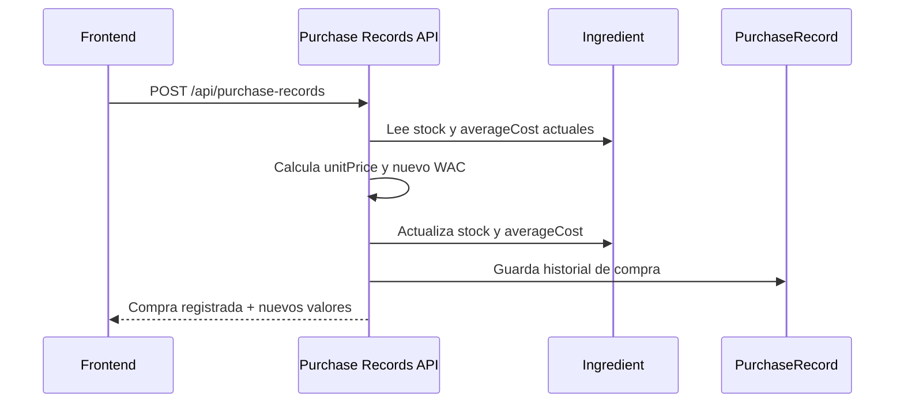

### Qué modifica

- `Ingredient.currentStock`
- `Ingredient.averageCost`
- nueva fila en `PurchaseRecord`

### Regla importante

El costo promedio ponderado se recalcula en cada compra.

---

## 8.3 Recetas y costeo

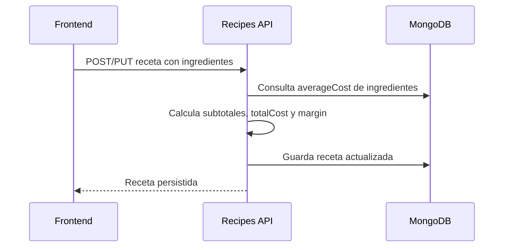

### Qué sale de aquí

- costo unitario del producto,
- margen vs precio de venta,
- estado de rentabilidad.

---

## 8.4 Producción

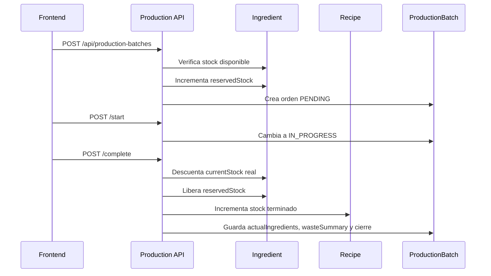

### Qué modifica

- `Ingredient.reservedStock`
- `Ingredient.currentStock`
- `Recipe.currentStock`
- `ProductionBatch`

### Idea operativa

La orden no produce “instantáneamente” al crearse. Primero aparta insumos, luego se inicia y finalmente se cierra con consumo real y merma.

---

## 8.5 Ventas

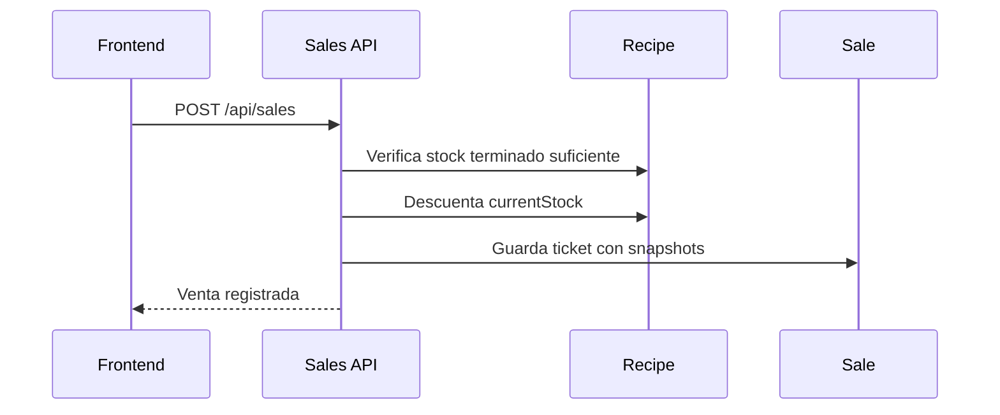

### Qué modifica

- `Recipe.currentStock`
- nueva fila en `Sale`

### Qué conserva

Cada venta guarda snapshot financiero para no depender de futuros cambios de costos o precios.

---

## 8.6 Dashboard

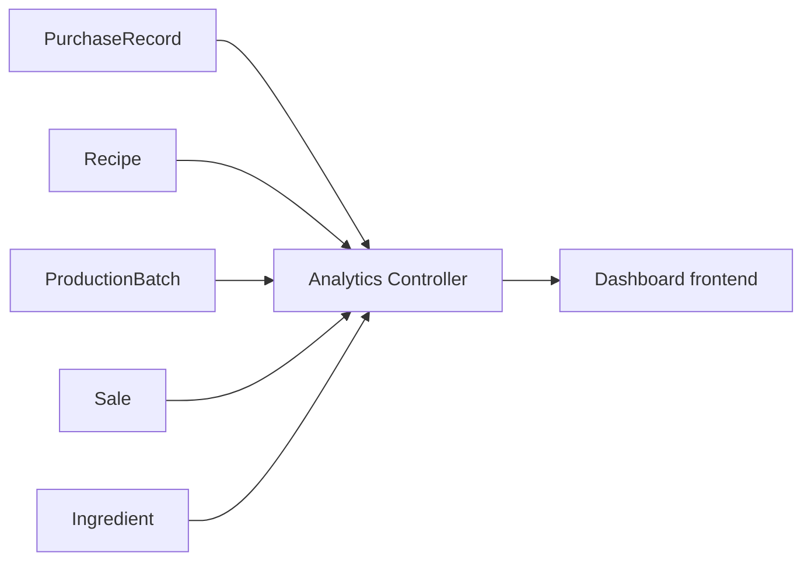

El dashboard no usa datos mock.

Consume agregaciones reales de:

- compras,
- stock de insumos,
- recetas,
- producción,
- ventas.

Ejemplos de KPIs:

- venta acumulada,
- margen bruto,
- merma estimada,
- presión de resurtido,
- mix de productos vendidos,
- alertas activas.

---

## 9. Contrato tipado entre backend y frontend

El proyecto no comparte tipos “a mano”. Comparte contrato por **OpenAPI**.

Flujo:

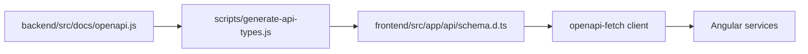

### Archivos clave

- `backend/src/docs/openapi.js`
- `scripts/generate-api-types.js`
- `frontend/src/app/api/schema.d.ts`
- `frontend/src/app/api/client.ts`

### Beneficio

Cuando cambia una ruta o un payload, el frontend puede regenerar tipos y detectar rupturas en compilación.

Comando:

```bash
npm run api:types
```

---

## 10. Autorización

La autorización existe en dos capas:

## Webapp

- guards de Angular
- navegación visible según rol
- redirección a ruta por defecto cuando el rol no tiene acceso

## API

- `requireAuth`
- `requireRoles(...)`

Esto es importante porque los guards del frontend mejoran UX, pero la seguridad real vive en backend.

---

## 11. Docker y despliegue local

El `docker-compose.yml` levanta:

- `frontend`
- `backend`
- `mongo`

Puertos actuales:

- frontend: `4200`
- backend: `3010` expuesto al host, `3000` dentro del contenedor
- mongo: interno entre contenedores

### Flujo local

```bash
docker compose up --build
```

### Detalles útiles

- el backend se conecta a Mongo con:
  - `mongodb://mongo:27017/monorepo`
- hay volúmenes separados para `node_modules`
- eso evita choques raros entre dependencias del host y del contenedor

---

## 12. Scripts importantes

## En la raíz

```bash
npm run api:types
npm run lint
npm run lint:fix
npm run format
npm run format:check
npm run seed:supply
npm run seed:activity
npm run verify:roles
```

## Seeder y verificación

### `seed:supply`

Carga datos base de abastecimiento.

### `seed:activity`

Genera actividad realista de las últimas dos semanas:

- compras,
- producción,
- ventas,
- usando usuarios reales por rol.

### `verify:roles`

Prueba los flujos por rol y valida que:

- permisos estén bien,
- stock aumente/disminuya donde debe,
- producción reserve/libere correctamente,
- ventas descuenten stock terminado.

---

## 13. Bibliotecas y por qué están aquí

## Frontend

- `@angular/*`
  - base del frontend
- `openapi-fetch`
  - cliente HTTP tipado desde OpenAPI
- `@ng-icons/core`, `@ng-icons/lucide`
  - iconografía
- `class-variance-authority`, `clsx`
  - variantes visuales del sistema UI
- `rxjs`
  - soporte reactivo del ecosistema Angular

## Backend

- `express`
  - servidor HTTP
- `mongoose`
  - modelado y acceso a MongoDB
- `cors`
  - acceso cruzado durante desarrollo/despliegue
- `dotenv`
  - variables de entorno

## Tooling

- `openapi-typescript`
  - generación de tipos
- `eslint`
  - consistencia estática
- `prettier`
  - formato
- `playwright`
  - automatización puntual / capturas

---

## 14. Cómo pensar el sistema al extenderlo

Si vas a agregar una feature nueva, la ruta recomendada es:

1. **definir el modelo** en backend si hace falta,
2. **crear o ajustar el endpoint** en controller + route,
3. **reflejarlo en OpenAPI**,
4. **regenerar tipos**,
5. **agregar interfaz/service/page** en frontend,
6. **protegerlo por rol** si aplica,
7. **conectarlo al dashboard** si genera eventos relevantes.

En otras palabras:

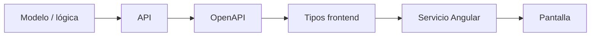

---

## 15. Decisiones importantes ya tomadas

- Se usa **MongoDB** como base real del proyecto.
- El contrato compartido se resolvió con **OpenAPI**, no con RPC.
- Los módulos principales ya no son mockups: son pantallas operativas.
- La UI sigue un patrón consistente:
  - tabla principal,
  - acciones claras,
  - modales para alta/edición/detalle.
- La seguridad se aplica en:
  - UI,
  - y API.

---

## 16. Riesgos o deuda técnica visible

Nada de esto bloquea operación, pero sí conviene tenerlo claro:

- no existe un motor genérico de conversión entre unidades heterogéneas;
- la merma vive principalmente integrada a producción, no como módulo separado;
- el sistema de JWT es propio y simple; si el proyecto creciera mucho, podría migrarse a una librería estándar más robusta;
- la lógica de agregación del dashboard está concentrada en un controller y podría dividirse más si creciera el dominio.

---

## 17. Resumen corto

KitchenFlow hoy funciona como:

- **Angular 21** en frontend,
- **Express + Mongoose** en backend,
- **MongoDB** como persistencia,
- **OpenAPI** como contrato entre capas,
- **JWT + roles** para seguridad,
- y **Docker Compose** para operación local/despliegue base.

La información sigue este patrón:

```text
Pantalla Angular
-> servicio Angular
-> cliente OpenAPI tipado
-> ruta/controller Express
-> modelo Mongoose
-> MongoDB
```

Y el flujo de negocio principal es:

```text
abastecimiento
-> recetas
-> producción
-> ventas
-> dashboard
```

Si alguien nuevo entra al proyecto, ése es el mapa mental correcto para empezar.
